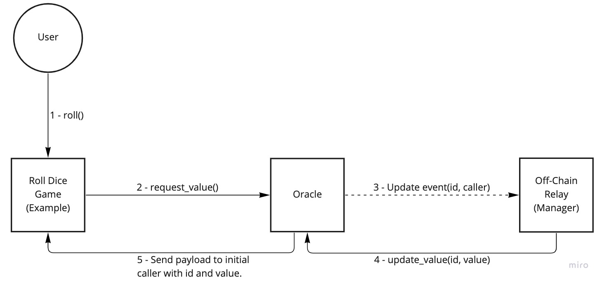
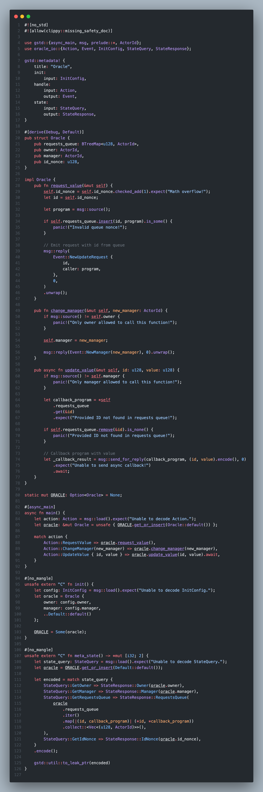

# Oracle

## Logic
Every time the caller contract wants to get the off-chain value, he must send specific action called `RequestValue`. Then internally oracle will manage request queue(increased by nonce) and emit new event for off-chain relay. When off-chain service processed new event,
```rust
UpdateValue {
    id: u128,
    value: u128
}
```
action must be called by manager(relay). Oracle owner may specify any manager and change him over-time. `UpdateValue` forms payload to initial caller program and execute it, then request id gets removed from `requests_queue`. Callee program must handle payload ahead of basic action handler by oracle program id. Example payload layout: `id: u128, value: u128`.

## Architecture



## Structs and functions

